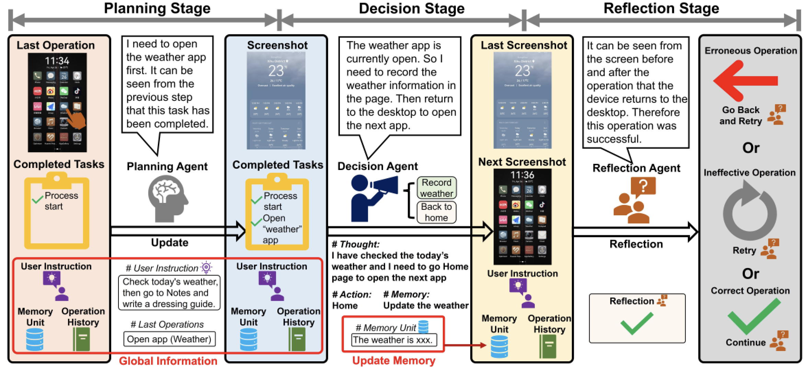

I am currently a Master’s student in Computer Science and Technology at [Beijing Jiaotong University](http://www.bjtu.edu.cn/) and work with [Prof. Jitao Sang](http://faculty.bjtu.edu.cn/9129/). I obtained a Bachelor’s degree in Computer Science and Technology from [Hebei University of Technology](https://www.hebut.edu.cn/).

🔥I am preparing my PhD applications and am actively seeking a summer research internship to enrich my research experience and secure a strong letter of recommendation. If my research aligns with your projects or if you are interested in collaborating, please feel free to reach out via email!😁🔥

## Research

I participated in the MLLMs-based AI Agent system project, Mobile Agent V2, which aims to develop a multi-agent system for mobile tasks automation. In this project, multiple agents—including a planning agent, a decision-making agent, and a reflection agent—work collaboratively to automate mobile tasks. Additionally, I was involved in the AMBER project, a hallucination study for MLLMs(multimodal large language models), focusing on hallucinations in both discriminative and generative tasks.

Recently, I have developed a strong interest in designing efficient LLMs-based and MLLMs-based agents, as well as exploring human-agent interaction. I am currently investigating ways to enhance agent decision-making capabilities through supervised and reinforcement learning algorithms. My current research interests include:

> - Human-centered AI
> - Human-in-the-loop Agent
> - Multi-agent Reinforcement Learning
> - Intelligent Decision-making

## Publications
<html>
<head>
  <meta charset="utf-8" />
  <title>Inline HTML Layout Example</title>
</head>
<body>

<!-- 外层容器：垂直排列多个条目 -->

  <!-- 第一个条目 -->
  

    
    

      <h2 style="margin: 0;"><a href="https://arxiv.org/abs/2406.01014" target="_blank">Mobile-Agent-v2: Mobile Device Operation Assistant with Effective Navigation via Multi-Agent Collaboration</a></h2>
      
Junyang Wang, Haiyang Xu, <strong>Haitao Jia</strong>, Xi Zhang, Ming Yan, Weizhou Shen, Ji Zhang, Fei Huang, Jitao Sang

      
<em>NeurIPS 2024</em>

    

  

  <!-- 你可以继续添加更多条目 -->

</body>
</html>

## Education

·*M.S (Computer Science)*, [Beijing Jiaotong University](http://www.bjtu.edu.cn/)  
*2023.9 - 2026.6*

·*B.S (Computer Science)*, [Hebei University of Technology](https://www.hebut.edu.cn)  
*2019.9 - 2023.6*

## Contact

email:
> 23120356@bitu.edu.cn

> jiaht1101@gmail.com

